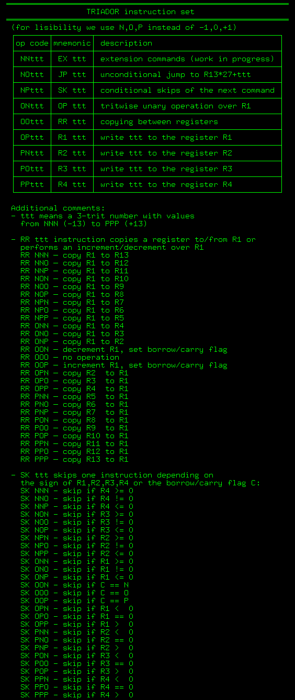

# A Novel Approach to Cryptography Using Ternary-Based Exponentiation with Randomized Keys

**Author: Abdelrahman FARAG**

**Affiliation: https://github.com/ssloy/triador **

**Contact: abdelrahmanfarag1980@gmail.com **

## Abstract
This paper presents a novel cryptographic method leveraging ternary-based exponentiation and randomized keys to enhance security. The method, which transforms traditional binary-based encryption, utilizes custom power functions and random keys for encryption and decryption. This paper details the theoretical foundations, practical implementation, and the mathematical representation of the encryption algorithm, demonstrating its effectiveness with a practical example.

## Introduction
Cryptography is essential for securing data in digital communication. Traditional cryptographic methods rely heavily on binary systems, which are foundational to modern computing. This paper introduces a novel approach that utilizes ternary (base-3) arithmetic, adding an additional layer of complexity and security. By incorporating randomized keys, we create a robust encryption mechanism that is computationally feasible and secure.

## Theoretical Foundation
The proposed method leverages ternary-based exponentiation, wherein the encryption and decryption processes use custom power functions combined with random keys. The ternary system uses three values: 0, 1, and 2. By applying these values in exponentiation and introducing randomness through keys, the system achieves a high level of security.

## Implementation on the Triador Ternary Computer

The Triador ternary computer, described in the Triador project, features a unique architecture based on balanced ternary numbers (-1, 0, 1). This section explains how to adapt the proposed cryptographic method to the Triador computer system.

### Triador Architecture
The Triador computer uses a 3-trit balanced ternary system with registers that can store numbers from -13 to +13. It includes the following components:
- Four main registers (R1-R4)
- Nine extra registers (R5-R13)
- A special register (R13) used for memory segmentation
- A 1-trit borrow/carry flag
- A 6-trit program counter register
- Read-only program memory with 27 segments, each containing 27 instructions



### Instruction Set
The Triador instruction set consists of 9 instructions, each with a mandatory 3-trit argument:
- EX ttt: Extension commands
- JP ttt: Unconditional jump
- SK ttt: Conditional skip
- OP ttt: Unary operation
- RR ttt: Register copying
- R1 ttt: Write to R1
- R2 ttt: Write to R2
- R3 ttt: Write to R3
- R4 ttt: Write to R4


### Practical Implementation
The encryption process involves generating public and private keys, using these keys to manipulate the exponentiation of base values, and subsequently encoding characters. Decryption reverses this process, utilizing the private key to retrieve the original data. Below is the Python implementation of the described cryptographic method.

### Python Code
```python
import random

# Key generation function
def generate_keys():
    pub_key = random.randint(2, 10)
    priv_key = pub_key + random.randint(1, 10)
    return pub_key, priv_key

# Encryption function
def encrypt_char(char, pub_key):
    if char in char_to_ternary:
        base, exp1, exp2 = char_to_ternary[char]
        encrypted_value = (custom_pow(base, exp1), custom_pow(base, exp2 + pub_key))
        print(f'ENCRYPTING: char={char}, base={base}, exp1={exp1}, exp2={exp2}, pub_key={pub_key}, encrypted_value={encrypted_value}')
        return encrypted_value
    return None

# Decryption function
def decrypt_ternary(ternary_pair, priv_key, pub_key):
    for char, value in char_to_ternary.items():
        base, exp1, exp2 = value
        decrypted_value = (custom_pow(base, exp1), custom_pow(base, exp2 + pub_key))
        print(f'DECRYPTING: Trying to decrypt with char={char}, base={base}, exp1={exp1}, exp2={exp2}, priv_key={priv_key}, pub_key={pub_key}, decrypted_value={decrypted_value}')
        if ternary_pair == decrypted_value:
            return char
    return None

# Custom power function
def custom_pow(base, exp):
    if base == 0:
        return 0
    elif exp == 0:
        return 1
    elif base == 1:
        return 1
    else:
        return base ** exp

# Ternary conversion map
char_to_ternary = {
    'A': (2, 3, 4),
    'B': (3, 2, 5),
    'C': (5, 2, 3),
}

# Example usage
pub_key, priv_key = generate_keys()
char = 'B'
encrypted = encrypt_char(char, pub_key)
print(f'Encrypted {char}: {encrypted}')

decrypted = decrypt_ternary(encrypted, priv_key, pub_key)
print(f'Decrypted {encrypted}: {decrypted}')
```

### Conclusion
By adapting your encryption and decryption algorithms to fit within the Triador's ternary architecture, you can explore the potential of ternary computing for cryptographic applications. This involves translating binary logic into ternary, utilizing the Triador's registers effectively, and converting your steps into the Triador's instruction set. The example programs provided demonstrate how to implement these steps on the Triador computer, showcasing the feasibility of this approach. Future work could involve optimizing these programs for efficiency and exploring other cryptographic algorithms within the ternary framework.

### References
1. Schneier, B. (1996). Applied Cryptography: Protocols, Algorithms, and Source Code in C. John Wiley & Sons.
2. Stallings, W. (2017). Cryptography and Network Security: Principles and Practice. Pearson.
3. Menezes, A. J., van Oorschot, P. C., & Vanstone, S. A. (1996). Handbook of Applied Cryptography. CRC Press.
